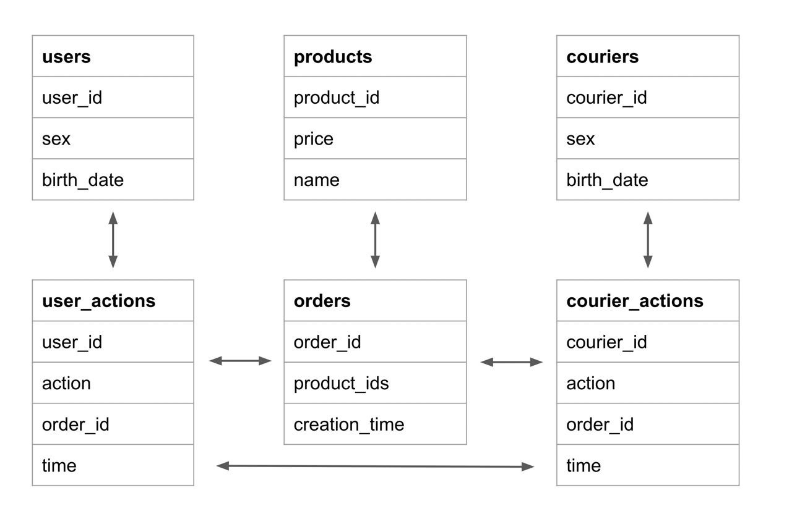

## Структура и наполнение таблиц

## user_actions — действия пользователей с заказами

| Столбец  | Тип данных  | Описание                                                                                                  |
|----------|-------------|-----------------------------------------------------------------------------------------------------------|
| user_id  | INT         | id пользователя                                                                                           |
| order_id | INT         | id заказа                                                                                                 |
| action   | VARCHAR(50) | действие пользователя с заказом; 'create_order' — создание заказа, 'cancel_order' — отмена заказа |
| time     | TIMESTAMP   | время совершения действия                                                                                 |

## courier_actions — действия курьеров с заказами

| Столбец    | Тип данных  | Описание                                                                                                  |
|------------|-------------|-----------------------------------------------------------------------------------------------------------|
| courier_id | INT         | id курьера                                                                                                |
| order_id   | INT         | id заказа                                                                                                 |
| action     | VARCHAR(50) | действие курьера с заказом;  'accept_order' — принятие заказа,  'deliver_order' — доставка заказа |
| time       | TIMESTAMP   | время совершения действия                                                                                 |

## orders — информация о заказах

| Столбец       | Тип данных | Описание                   |
|---------------|------------|----------------------------|
| order_id      | INT        | id заказа                  |
| creation_time | TIMESTAMP  | время создания заказа      |
| product_ids   | INTEGER[]  | список id товаров в заказе |

## users — информация о пользователях

| Столбец    | Тип данных  | Описание                                          |
|------------|-------------|---------------------------------------------------|
| user_id    | INT         | id пользователя                                   |
| birth_date | DATE        | дата рождения                                     |
| sex        | VARCHAR(50) | пол; 'male' — мужской, 'female' — женский |

## couriers — информация о курьерах

| Столбец    | Тип данных  | Описание                                          |
|------------|-------------|---------------------------------------------------|
| courier_id | INT         | id курьера                                        |
| birth_date | DATE        | дата рождения                                     |
| sex        | VARCHAR(50) | пол; 'male' — мужской, 'female' — женский |

## products — информация о товарах, которые доставляет сервис

| Столбец    | Тип данных  | Описание        |
|------------|-------------|-----------------|
| product_id | INT         | id продукта     |
| name       | VARCHAR(50) | название товара |
| price      | NUMERIC(5)  | цена товара     |

